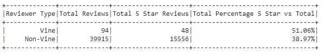

# Amazon_Vine_Analysis

## Overview of the Analysis

This analysis is meant to look into the reviews associated with the Amazon Vine Program to determine if there is any bias toward favorable reviews from Vine members. To do this, the ETL process will be utilized to grab the Amazon data, clean it up, and load it into a database. Following this, we will analyze our data by finding the amount of 5 star reviews as compared to total reviews for both members and non-members of the Vine Program.

## Results

After the data was filtered to only show reviews the greater than or equal to 20 votes with atleast half of those votes being helpful the results were as follows:

- There were a total of 94 Vine reviews and 39915 Non-Vine Reviews.

- Out of the total reviews,  48 (51% of total) Vine Reviews were 5 stars and 15556 (39% of total) Non-Vine Reviews were 5 stars.

## Summary

The results from this analysis do indeed suggest a positivity bias for Vine members who had left a review with 51% of their total reviews being 5 stars while ofnly 39% of Non-Vine reviews ended up being 5 star reviews. One other analysis I could suggest would be to look at the Vine and Non-Vine member groups, but compare your reviews with whether there was a verified purchase or not. This could see if more Vine member reviews led to purchases or if ther is no change between the two groups.